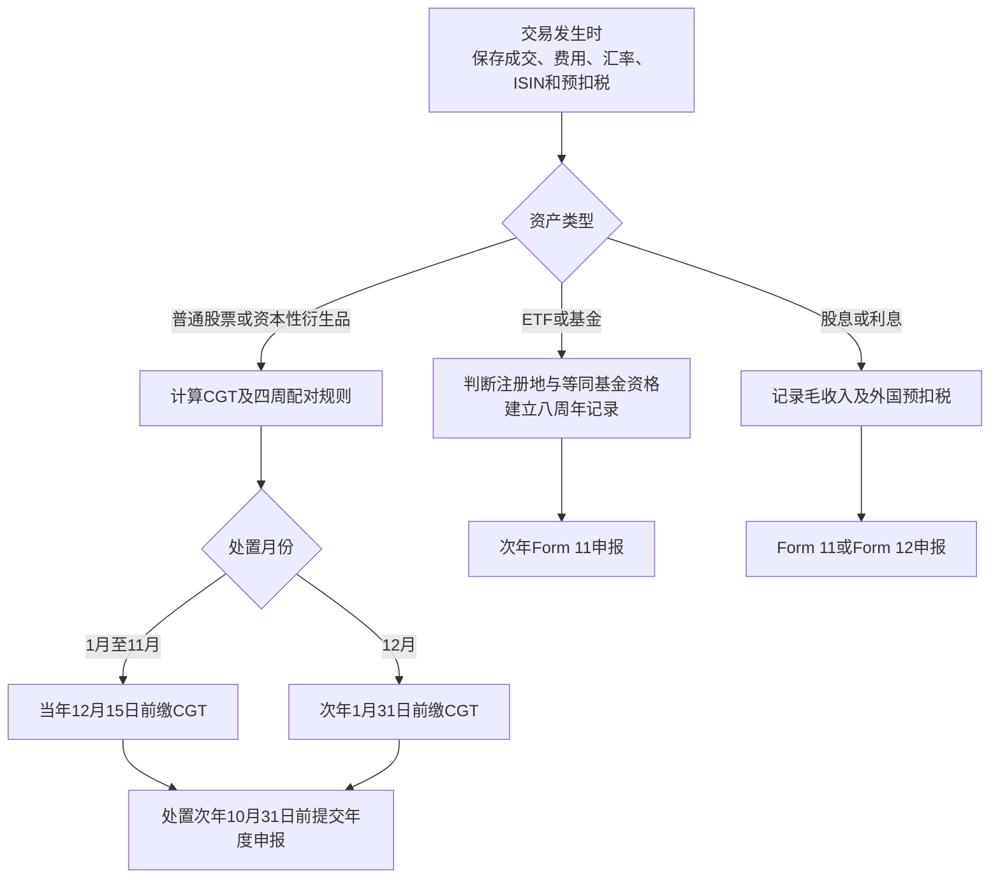

# 中国留学生通过 Trading 212 投资的爱尔兰税务分析报告

## 执行摘要

截至 **2026年8月5日**，你的中国国籍和留学生身份本身并不决定爱尔兰税负；最关键的是每个自然年度在爱尔兰停留的天数，以及你是否属于爱尔兰税务居民、通常居民（ordinary resident）和爱尔兰住所人（domiciled）。一般而言，一个税年在爱尔兰停留至少 **183天**，或本年与上一年合计至少 **280天**，即可能成为爱尔兰税务居民。中国留学生通常仍保有中国原始住所，因此即使成为爱尔兰税务居民，也可能作为“非爱尔兰住所居民”就境外投资收入和境外资本利得适用 **汇入制（remittance basis）**：只有汇入、带入或用于爱尔兰的部分才在爱尔兰纳税；但爱尔兰来源所得始终可能纳税。citeturn19search10turn19search15turn1search3turn1search6

对 Trading 212 投资而言，必须首先区分资产性质。直接持有普通股票，出售收益通常适用 **33%资本利得税（CGT）**，个人每年有 **€1,270** 的资本利得免税额；持有时间短并不会自动提高税率。但是，大量 Trading 212 用户持有的爱尔兰或欧盟 UCITS ETF，可能适用完全不同的基金税制：自2026年起通常按 **38%** 征税，并且每持有八年发生一次“视同处置”，不能使用 €1,270 的 CGT 免税额。citeturn3search13turn3search15turn16search0turn16search4turn16search5

股息不是资本利得。爱尔兰税务居民取得股票股息，通常按个人边际所得税率 **20%或40%** 征税，并可能另加 USC 和 Class S PRSI；爱尔兰公司股息一般先扣 **25% DWT**，但该25%通常只是预缴税，可在申报时抵免。利息的处理取决于付款人和产品结构：爱尔兰或欧盟银行存款利息一般按 **33%** 的 DIRT 类似税率处理；英国或其他非欧盟存款利息可能按33%与个人边际税率中的较高者征税。Trading 212 的“现金利息”有时涉及银行、有时涉及货币市场基金，因此不能仅凭平台名称判断。citeturn16search17turn17search0turn17search1turn15search4turn15search12

Trading 212通常不会为爱尔兰居民代扣爱尔兰资本利得税，也不会替你完成 Revenue 申报；它可能扣除股票来源国股息预扣税，并根据 CRS 收集、报告你的税务居民身份、TIN、账户余额、投资收入和出售收入。你应自行下载年度报表和 CSV，按照爱尔兰规则重新计算，而不能直接把平台显示的总盈亏填入申报表。citeturn18search2turn18search3turn18search7turn18search9

## 税务居民、通常居民和住所的判定

爱尔兰个人所得税税年是每年 **1月1日至12月31日**。符合以下任一标准，通常即为该税年的爱尔兰税务居民：

| 判定标准 | 规则 |
|---|---|
| 单年标准 | 一个税年在爱尔兰停留至少 **183天** |
| 两年合计标准 | 本税年与上一税年合计至少 **280天**，且本税年至少停留31天 |
| 天数计算 | 一天中的任何时间人在爱尔兰，通常均计作一天 |
| 学生身份 | 留学生没有独立的税务居民豁免，仍按停留天数判断 |

如果某一税年仅在爱尔兰停留不超过30天，该年度通常不能仅依靠两年280天规则被视为居民。学生签证、学期长度、是否租房并不能取代法定天数测试。citeturn1search1turn1search14

**通常居民（ordinary residence）**与当年税务居民不同。连续三个税年为爱尔兰税务居民后，一般从第四个税年开始成为通常居民；离开爱尔兰后，通常居民身份一般还会持续三个完整税年。因此，毕业离境并不一定立刻终止所有爱尔兰税务联系。citeturn1search7turn0search0

**住所（domicile）**不是国籍、签证或当前居住地址，而是指一个人视为永久归属地的法律概念。通常在出生时取得原始住所，除非通过在另一国家长期定居并具有永久居住意图而取得选择住所。仅因在爱尔兰读书、租房或住数年，通常不足以自动取得爱尔兰住所；因此，多数暂时赴爱尔兰学习的中国学生很可能仍属非爱尔兰住所，但必须根据永久居留意图、家庭联系、长期住房和未来计划逐案判断。citeturn1search3turn1search20

不同身份对投资税负的基本影响如下：

| 身份组合 | 通常适用的投资所得范围 |
|---|---|
| 爱尔兰居民且爱尔兰住所 | 全球股息、利息和资本利得均须在爱尔兰申报，外国税可视协定申请抵免 |
| 爱尔兰居民但非爱尔兰住所 | 爱尔兰来源所得，以及汇入或用于爱尔兰的境外收入和境外资本利得 |
| 非居民、非通常居民、非爱尔兰住所 | 一般仅对爱尔兰来源所得及特定爱尔兰资产资本利得纳税 |
| 非居民但仍为通常居民 | 可能仍受扩展征税规则约束，离境后不能简单假定完全脱离爱尔兰税制 |

citeturn19search5turn1search6turn1search11

所谓“汇入”不限于把钱转到爱尔兰银行账户。用境外投资账户或银行卡支付爱尔兰房租、学费、生活费，将投资收益转给爱尔兰境内的人，或以其他方式在爱尔兰使用相关资金，都可能构成汇入。混合账户中如果同时存有本金、股息、利息和资本利得，证明究竟汇入了哪一类资金会非常困难，因此依赖汇入制的人应当分开保存入境前本金、境外收入和资本利得。citeturn1search6turn1search20

爱尔兰的“分年度处理（split-year treatment）”主要针对就业收入，并不普遍扩展到股票、ETF、股息或资本利得。因此，即使你年中到达或离开，也不能自动将到达前或离境后的投资收益排除在外。citeturn1search2turn1search5

## 股票、基金、利息和衍生品的税务处理

下表假定你属于爱尔兰税务居民，且相关境外款项已经属于爱尔兰应税范围；非爱尔兰住所人的汇入制例外需另行判断。

| 投资类型 | 2026年通常税务处理 | 关键注意事项 |
|---|---|---|
| 直接持有普通股票的出售收益 | 一般按 **33% CGT**；个人年度免税额 **€1,270** | 对净资本利得征税，不对出售总额征税；短期持有本身不改变税率 |
| 爱尔兰公司股息 | 毛股息按所得税 **20%/40%**，并可能加 USC、PRSI；通常预扣 **25% DWT** | 25% DWT通常可抵减最终所得税，不是统一最终税率 |
| 外国公司股息 | 毛额按20%/40%，并可能加 USC、PRSI | 必须申报扣税前金额；外国预扣税可按适用协定抵免 |
| 爱尔兰银行存款利息 | 通常 **33% DIRT**，由银行代扣 | DIRT利息通常不缴USC；某些情形仍可能缴PRSI |
| 欧盟银行存款利息 | 通常按与DIRT相同的 **33%** 税率自行申报 | 境外机构通常不会代扣爱尔兰税 |
| 英国及其他非欧盟存款利息 | 及时正确申报时，通常按33%或个人边际所得税率中的较高者 | 高税率纳税人可能按40%；通常不缴USC，PRSI可能适用 |
| 爱尔兰基金、等同境外基金、许多UCITS ETF | 2026年起通常 **38%**；每八年视同处置 | 不适用€1,270 CGT免税额，通常不能用普通资本亏损抵减 |
| 非等同境外基金 | 分配可能按20%/40%所得税，出售收益可能按33% CGT | 是否“等同”必须逐只基金分析，不能仅凭“ETF”标签 |
| CFD、期权、期货等衍生品 | 若属投资资本，通常可能按CGT处理；若构成交易业务，则按交易所得征税 | 分类高度依赖事实，应保存合约、结算和融资费用资料 |
| 高频短线交易 | 没有单独的“短期资本利得税率” | 高频本身不自动变成自雇交易业务，但可能增加被认定为trade的风险 |

普通股票资本利得是出售价格减去购买成本及可扣除交易费用后的净额。资本亏损通常可抵减同年度其他资本利得并向以后年度结转，但不能抵减股息、利息或工资；€1,270年度免税额不能结转。citeturn15search21turn3search4turn0search19

爱尔兰股票成本配对并非完全等同于 Trading 212 平台计算。通常适用先进先出原则，但四周内买卖同类股票有特殊规则：出售后四周内重新购买，可能触发后进先出式配对和亏损限制，防止通过年底卖出后迅速买回制造可立即抵税的亏损。citeturn3search0turn4search20

股息应按**毛额**申报。例如爱尔兰公司宣布股息€100，扣除€25 DWT后你收到€75，申报金额通常仍为€100，并把€25作为已扣税款抵免。2026年单身个人的一般所得税标准税率带为前€44,000按20%，余额按40%；股息还计入USC总收入，2026年标准USC档次为0.5%、2%、3%和8%，总收入不超过€13,000时可能豁免。投资收入达到相关条件时还可能产生Class S PRSI，2026年税率在9月30日前为4.2%，10月1日起为4.35%。citeturn16search17turn17search0turn17search1turn17search2turn17search9

基金和ETF是最常见的合规风险。爱尔兰注册基金以及与爱尔兰基金“等同”的欧盟、欧洲经济区或合格协定国基金，通常适用基金退出税制度。自2026年1月1日起，个人的应税分配、实际处置收益及八年视同处置收益通常按38%征税，不加USC或PRSI。交易所交易ETF通常不会在平台端扣爱尔兰退出税，所以必须自行申报。citeturn16search0turn16search4turn16search5turn16search13

判断一只ETF的税制时，应查看其 **ISIN、注册地、法律形式、UCITS状态和基金文件**。例如，爱尔兰注册的UCITS ETF通常很可能适用38%和八年视同处置，而直接持有美国公司的普通股票通常适用33% CGT。美国注册ETF和其他非欧盟基金的处理不能仅凭交易所或交易货币判断，必要时应进行逐只基金分类。citeturn16search0turn16search5

对于Trading 212的CFD或其他衍生品，爱尔兰税法没有一个仅按“交易次数”决定性质的简单标准。Revenue会参考“交易标志（badges of trade）”，包括购买目的、持有时间、重复性、组织程度、融资和杠杆、是否以商业方式持续经营等。如果整体活动构成trade，净利润将按所得税20%/40%加USC和PRSI处理，而不是33% CGT；亏损适用的也将是交易亏损规则。citeturn3search1turn4search16

## 居民、非居民与中爱税收协定

如果你是爱尔兰税务居民且具有爱尔兰住所，原则上应申报全球投资收入和资本利得。如果你是爱尔兰税务居民但仍具有中国住所，则境外股票、外国股息和境外资本利得可能适用汇入制；不过，爱尔兰公司股息、爱尔兰银行利息和爱尔兰资产收益通常属于爱尔兰来源，不能仅因款项留在Trading 212账户而排除。citeturn19search5turn1search6turn1search11

如果你不是爱尔兰税务居民且也不是通常居民，爱尔兰一般不会对普通境外股票和境外ETF的出售收益征税。非居民CGT主要针对特定爱尔兰资产，例如爱尔兰不动产、矿产权益、爱尔兰营业资产以及主要价值来自爱尔兰土地的某些非上市股份。非居民仍可享有个人€1,270 CGT年度免税额，但只有落入爱尔兰征税范围的资本利得才需要使用该免税额。citeturn1search11turn0search1turn0search9

爱尔兰公司向非居民个人支付股息时，默认仍可能扣25% DWT。符合条件的协定国居民可通过经居住国税务机关认证的 **Form V2A** 申请非居民DWT豁免；该豁免并非自动生效，通常需提前交给付款公司、合格中介或授权扣缴代理。若券商托管链无法在付款时应用豁免，可能需要事后申请退税。citeturn16search3turn16search7turn19search21

《中国—爱尔兰避免双重征税协定》适用于一方或双方的**税务居民**，不是仅凭中国国籍适用。如果中国和爱尔兰均依据各自国内法认为你是税务居民，协定第四条依次考察永久住所、重要利益中心、经常居所、国籍，最后由两国主管机关协商确定协定居民身份。citeturn7view0turn9view0

协定对投资所得的主要规则如下：

| 所得类别 | 中爱协定主要规则 |
|---|---|
| 股息 | 来源国可以征税；个人作为受益所有人时，来源国税率一般不超过股息毛额的 **10%** |
| 利息 | 来源国税率一般不超过利息毛额的 **10%**，部分政府或公共机构利息可能豁免 |
| 不动产资本利得 | 不动产所在地国家可以征税 |
| 土地价值型公司股份 | 主要价值来自所在地不动产的股份，所在地国家可征税 |
| 其他普通财产资本利得 | 通常仅由转让人作为协定居民的国家征税 |
| 双重征税抵免 | 爱尔兰居民可就依协定在中国缴纳的税申请爱尔兰外国税收抵免，通常不超过同一所得对应的爱尔兰税额 |

citeturn7view0turn9view1turn9view2turn9view3turn9view4

协定的10%股息税率是来源国可征税的上限，而爱尔兰国内法的合格非居民DWT豁免可能更优惠，达到0%。反之，如果你是爱尔兰协定居民并投资美国股票，适用的是爱尔兰与美国之间的规则，而不是中爱协定；中国国籍本身不会使美国股息自动适用中美协定。你应确保Trading 212中的税务居住国和W-8BEN填写与实际协定居民身份一致。citeturn16search3turn18search7turn18search9

在爱尔兰申报中国来源股息或利息时，通常应填报**扣除中国税前的毛额**，并填入实际且不可退还的中国税款，申请双重征税抵免。应保留中国扣缴证明、付款凭证、股息通知和汇率记录。需要在中国申请协定优惠时，爱尔兰税务居民可通过Revenue的myAccount申请 **Letter of Residence**。citeturn19search5turn19search12turn19search15

协定中的学生条款主要保护为生活、教育、学习或培训而从境外取得的款项及特定奖学金，并不会把股票交易、股息、基金或利息收入普遍免税。citeturn7view0

## Trading 212的代扣、信息披露和报表

Trading 212目前说明，爱尔兰新客户通常归属于德国监管的 **Trading 212 EU GmbH**；但旧账户或已迁移账户可能不同，因此应在App内确认具体签约实体。实体所在地会影响现金利息来源、CRS报告路径和部分预扣税处理，但不会免除你向爱尔兰Revenue申报的义务。citeturn18search6

对于爱尔兰税务居民，Trading 212通常：

| 项目 | 平台通常做法 |
|---|---|
| 爱尔兰CGT | 不代扣、不代算，投资者自行计算和缴纳 |
| 爱尔兰所得税、USC、PRSI | 通常不代扣 |
| 股票来源国股息预扣税 | 可能按股票发行国规则扣除 |
| 美国股息 | 根据有效W-8BEN及税务居民身份适用相应预扣税率 |
| 爱尔兰DWT | 投资爱尔兰公司时，可能通过托管链扣除 |
| 年度税表 | 提供年度报表，但通常不保证按照爱尔兰税法完成分类或计算 |
| CRS信息 | 收集税务居民国家、TIN等，并可能向其本国税务机关报告后交换给Revenue |

citeturn18search3turn18search7turn18search9

Trading 212为德国税务居民提供的自动德国资本所得税服务，不适用于仅为爱尔兰税务居民的客户。因此，即使账户实体是Trading 212 EU GmbH，也不能假定德国平台已经缴纳爱尔兰税。citeturn18search4

在CRS框架下，金融机构通常报告税务居民身份、税号、年末账户余额或价值、股息、利息以及出售或赎回金融资产的总收入。对爱尔兰客户而言，信息可能先报送德国或相关实体所在地税务机关，再自动交换给Revenue；这意味着“钱一直留在券商、未转入爱尔兰银行”并不等于Revenue无法获得账户资料。citeturn18search9turn14search0turn14search4turn14search11

每个税年结束后，应从App的 **Menu → Documents → Account statements** 下载年度报表，并另行导出订单、交易、股息和现金活动CSV。Trading 212明确指出，年度报表可用于报税，但其数据主要反映平台交易活动，并不替你应用爱尔兰的四周配对规则、ETF八年视同处置、汇入制或资本与交易收入分类。citeturn18search0turn18search2turn18search3

Trading 212“现金利息”需要特别检查年度报表和条款。如果款项法律上是德国或其他欧盟银行支付的存款利息，可能按欧盟存款利息33%处理；如果现金实际投放于合格货币市场基金，则可能适用基金38%和视同处置规则；如果属于非欧盟来源利息，则可能按33%或40%中的较高者纳税。不能简单地将所有“Interest on cash”统一归入DIRT。citeturn15search4turn15search12turn16search5

## 申报表格、付款期限和罚则

投资收入申报表取决于你是否属于“应自行评税人员（chargeable person）”：

| 情形 | 通常使用的渠道和表格 |
|---|---|
| 有PAYE收入，净应税非PAYE收入不超过€5,000且毛额不超过€30,000 | 通过myAccount提交在线 **Form 12/Income Tax Return** |
| 净应税非PAYE收入超过€5,000，或毛额超过€30,000 | 注册Income Tax self-assessment，通过ROS提交 **Form 11** |
| 只有资本资产处置且不是Form 11申报人 | 可提交 **Form CG1** |
| 已经提交Form 11 | 将资本利得一并填入Form 11，无需重复提交CG1 |
| 持有需自行申报的爱尔兰/等同境外基金 | 通常应提交Form 11，并在离岸基金相关栏目申报取得、收入、处置或视同处置 |

citeturn19search0turn19search6turn19search9turn15search7turn15search10

需要注册自行评税时，可使用Revenue的 **eRegistration** 服务，或提交Form TR1。注册为自行评税人员不等于Revenue已经认定你是职业交易者；被动投资者也可能仅因投资收入超过门槛或持有特定离岸基金而需要Form 11。citeturn19search9turn19search19

资本利得税的**付款期限早于年度申报期限**：

| 处置日期 | CGT付款期限 |
|---|---|
| 1月1日至11月30日 | 当年 **12月15日** |
| 12月1日至12月31日 | 次年 **1月31日** |
| CGT年度申报 | 处置次年的 **10月31日** 前 |

即使因资本亏损或€1,270免税额而没有CGT应付，只要发生应报告的资产处置，通常仍有申报义务。citeturn15search0turn15search16turn15search21

以当前可申报的2025税年为例，法定Form 11/Form 12/CG1申报日期为 **2026年10月31日**。符合条件、同时通过ROS在线提交Form 11并在线缴纳2025年余额税及2026年预缴税的自行评税纳税人，2026年的ROS延长期限为 **2026年11月18日**；这一延长期限每年可能不同，不能永久套用。citeturn15search3turn16search25turn10search0turn10search4

Form 11的Pay and File通常包括三件事：提交上一税年申报表、缴纳上一税年余额税，以及缴纳本税年的初步税（preliminary tax）。这可能导致首次进入自行评税时一次性付款金额明显高于单纯的上一年度税款。citeturn15search1turn16search11

迟交申报表的附加费通常为：逾期不超过两个月，按应纳税额的 **5%**，最高€12,695；逾期超过两个月，按 **10%**，最高€63,485。迟缴税款还会产生法定利息；漏报、错误抵免或故意隐瞒账户可能进一步引起补税、利息、罚款和审查。citeturn15search1turn15search3turn15search19

与所得税和CGT计算相关的原始记录一般应保存至少 **六年**。平台账户关闭后可能无法长期生成所有文件，因此应每年自行下载并备份PDF、CSV、W-8BEN、股息凭证和基金文件。citeturn19search1turn18search0turn18search2

## 实务建议、权威来源与“我该做的清单”

长期被动持有和频繁交易的主要差别不是简单的持有天数税率，而是资产分类和活动性质。长期持有普通股票通常适用股息所得税加出售时33% CGT；长期持有UCITS ETF可能每八年按38%视同处置，即使没有卖出也需纳税。频繁短线股票交易通常仍可能是资本投资，但如果活动具有持续、系统、商业化和以交易获利为主要目的等特征，则可能被Revenue认定为trade，改按所得税、USC和PRSI计税。citeturn16search0turn3search13turn3search1turn4search16

不应仅因为自己“经常交易”就注册某种独立的“投资自雇身份”。首先应判断是否已经构成真正的交易业务；但无论是否属于职业交易者，只要非PAYE收入超过门槛、持有需自行申报的离岸基金或存在其他chargeable person条件，都可能需要注册Income Tax self-assessment。citeturn19search6turn19search9turn19search19

合规记录至少应包含：成交日期和结算日期、证券名称及ISIN、买卖数量、交易币种、欧元折算汇率、佣金和税费、股息毛额、各国预扣税、现金利息、公司行动、基金注册地和法律文件、每批ETF的购买日期及八周年日期。对同一股票分批买卖时，应自行重建爱尔兰税务成本，而非使用Trading 212的平均成本或平台“return”数字。citeturn18search1turn18search2turn3search0

合法降低合规成本和税务风险的做法包括：在买入前确认是普通股票还是基金；每年利用但不滥用€1,270 CGT免税额；在年底前审视可用资本亏损，同时遵守四周回购限制；及时提交W-8BEN和协定居住证明；依赖汇入制时分开保管入境前本金、境外收入和境外资本利得；不要将普通资本亏损错误用于抵减股息或基金退出税。citeturn3search4turn4search20turn18search7turn1search6turn16search0

建议优先查阅的权威材料是Revenue的税务居民与住所指南、资本利得税指南、股息与DWT指南、离岸基金和投资机构税务手册、自行评税与Pay and File指南、中爱税收协定正式文本，以及Trading 212官方税务与年度报表说明。citeturn19search10turn15search0turn16search7turn16search0turn15search1turn7view0turn18search2turn18search3

**我该做的清单，按优先级：**

1. **逐年计算爱尔兰停留天数。** 对每个税年分别检查183天和两年280天标准，保存护照出入境、机票、租赁和学校记录。citeturn1search1  
2. **确认住所和汇入制资格。** 如果赴爱尔兰主要为学习、仍计划返回中国，应记录家庭、永久住房及长期意图；不要未经分析就假定自己已成为爱尔兰住所人。citeturn1search3turn1search6  
3. **在Trading 212中核对税务资料。** 确认税务居住国、爱尔兰PPSN/TIN、账户签约实体和W-8BEN均准确；双重居民时先完成协定tie-breaker分析。citeturn18search6turn18search7turn18search9  
4. **下载全部历史报表。** 获取年度报表、月度报表、交易CSV、股息、现金利息、费用报告和W-8BEN，并至少保存六年。citeturn18search0turn18search2turn19search1  
5. **制作资产分类表。** 把每个持仓标记为普通股票、爱尔兰基金、UCITS/等同境外基金、非等同基金、债券、现金利息或衍生品；ETF必须记录ISIN、注册地和首次买入日期。citeturn16search0turn16search5  
6. **计算当年已实现资本利得。** 按欧元计算每笔成本和出售款，应用FIFO及四周规则；1月至11月的应纳CGT在12月15日前缴纳，12月处置在次年1月31日前缴纳。citeturn15search0turn3search0  
7. **单独计算股息、利息和基金收益。** 使用毛收入，不使用到账净额；记录来源国预扣税，判断Trading 212现金回报究竟属于欧盟存款利息、非欧盟利息还是基金收益。citeturn16search17turn15search4turn15search12  
8. **决定Form 12、Form 11或CG1。** 非PAYE净收入超过€5,000或毛额超过€30,000，通常注册自行评税并提交Form 11；低于门槛通常可通过myAccount的Form 12申报；只有CGT且不是Form 11申报人时使用CG1。citeturn19search6turn19search9turn15search10  
9. **检查ETF八年视同处置。** 从每批基金实际购买日起分别计算八周年，不要等待平台提醒；适用基金税制的持仓通常不能使用€1,270 CGT免税额。citeturn16search0turn16search4  
10. **对重大或不确定项目取得爱尔兰专业意见。** 尤其是使用汇入制、混合资金账户、美国注册ETF、CFD、高频杠杆交易、多个国家税务居民身份或累计收益较大时，应由熟悉个人国际税和爱尔兰基金税制的税务顾问审核。